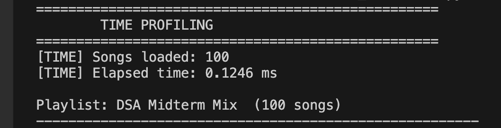
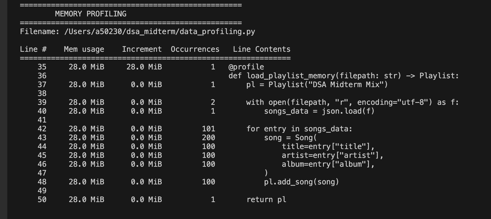

# dsa_midterm

- Time Profiling: 

Los resultados de profiling muestran que la carga de la playlist es altamente eficiente tanto en tiempo como en memoria. En términos de rendimiento, se lograron cargar 100 canciones en aproximadamente 0.11 ms.

- Memory Profiling: 
En cuanto al uso de memoria, el consumo se mantiene estable en 28.8 MiB durante todo el proceso, sin incrementos significativos por operación, lo que sugiere que la estructura de datos (lista doblemente enlazada) está bien implementada y no genera sobrecarga adicional al insertar elementos.

